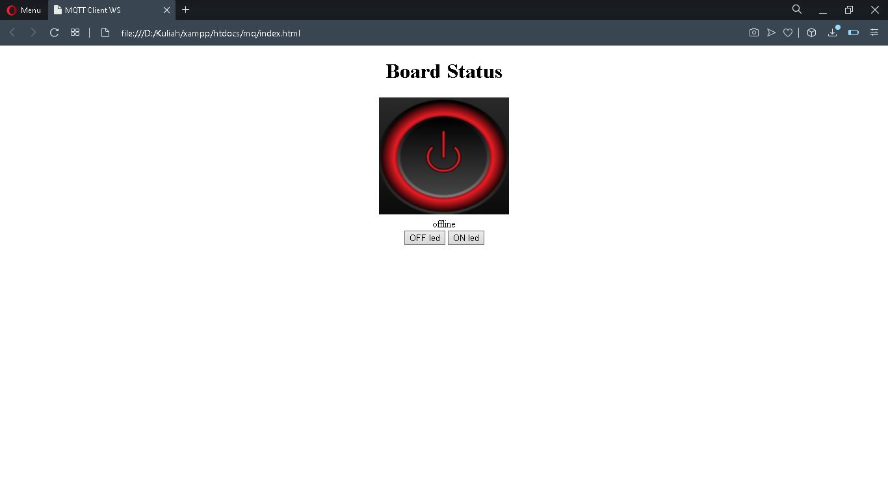

# Simple-MQTT-websocket-using-NodeMCU
This is a basic MQTT protocol example using web pages and esp8266 nodemcu. 

### Requirements

  * Breadboard
  * Sublime Text Editor
  * Arduino IDE
  * A Wifi Network 
 
### Usage

  * Connect NodeMCU to your device
  * Open ```mqtt_1.ino```using  Arduino IDE, change ```ssid``` and ```password``` for your network.
  * Make sure that your Publish's topic match with the ```app.js``` Subscribe and Subscribe's topic match with the ```app.js``` Publish
  * Then install this file to nodemcu module using usb cable
  * Open ```index.html``` with your browser to monitor the board's status. And to turn the buildin led simply click on ```OFF led``` and ```ON led```

### Important Files

 * ```mqtt_1.ino```
 * ```index.html```
 * ```app.js```
 
### Webpages view
#OFFLINE
  
#ONLINE
  
